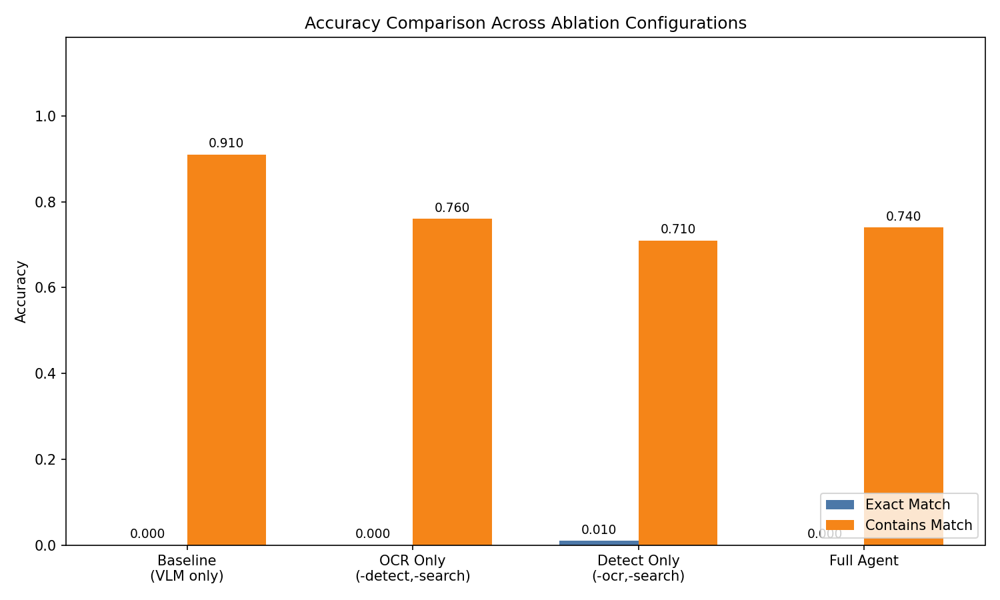
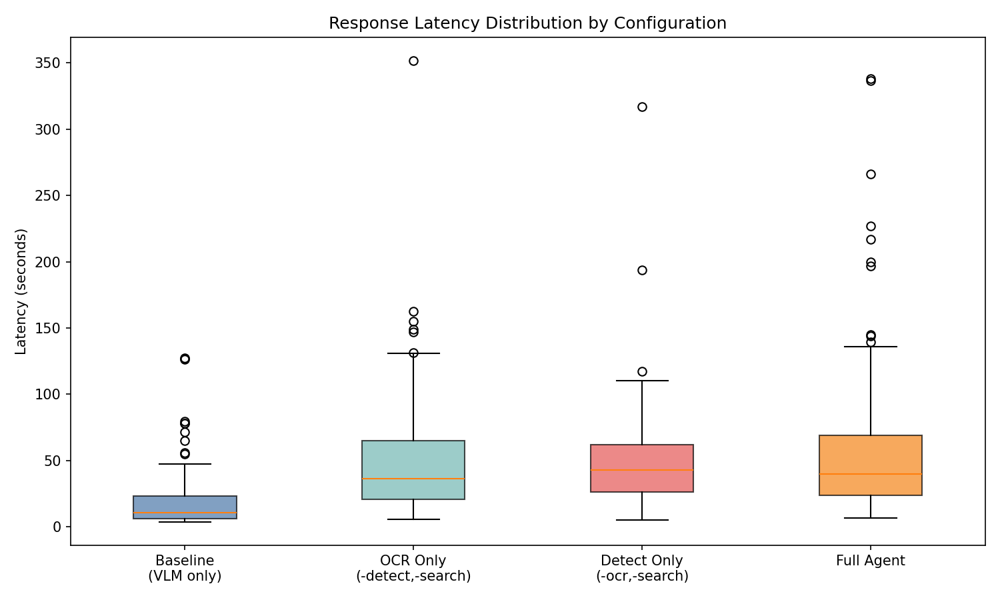
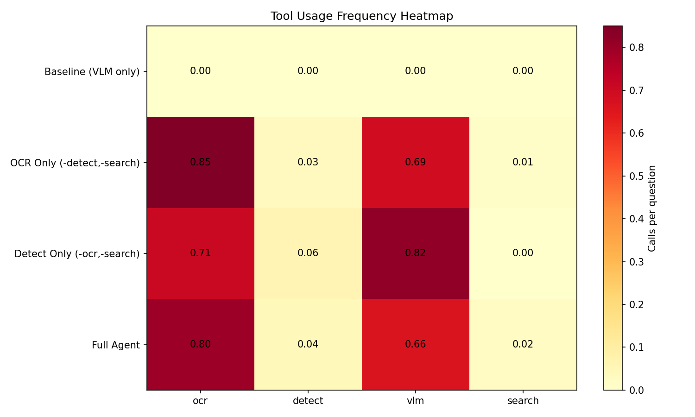
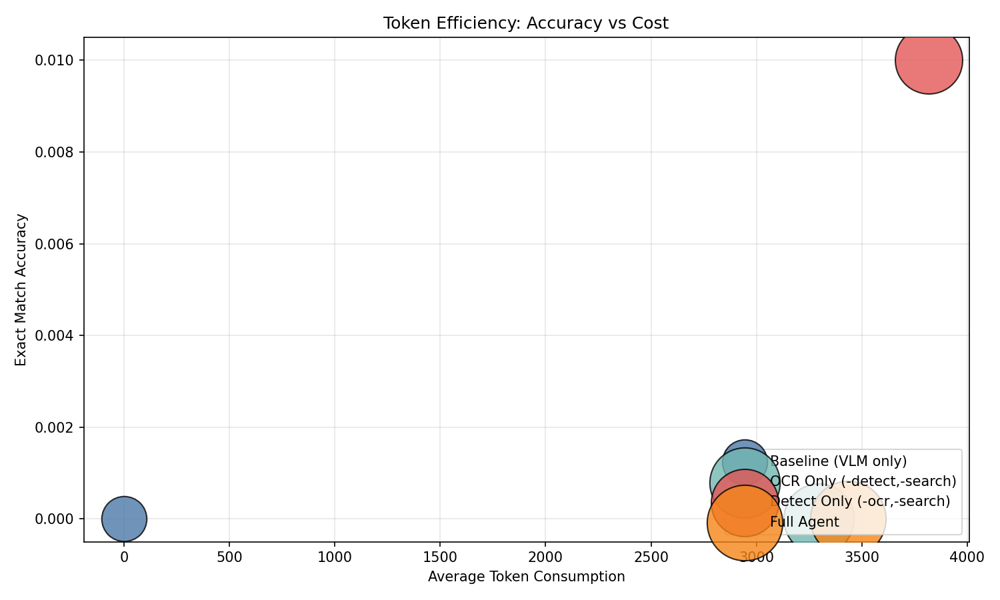

# Ablation Experiment Report

## Experiment Setup

- **Dataset**: TextVQA validation set, 100 sampled questions
- **Max agent steps**: 4
- **Model**: claude-sonnet-4-6

### Configurations

| Name | Description |
|------|-------------|
| Baseline (VLM only) | Direct VLM call without any tools |
| OCR Only | Agent with OCR + VLM only (detect/search disabled) |
| Detect Only | Agent with detection + VLM only (ocr/search disabled) |
| Full Agent | Full ReAct agent with all tools available |

## Results

| Configuration | N | EM Accuracy | Contains Accuracy | Avg Latency (s) | Avg Tokens |
|---------------|----|-------------|-------------------|-----------------|------------|
| Baseline (VLM only) | 100 | 0.000 | 0.910 | 21.0 | 0 |
| OCR Only | 100 | 0.000 | 0.760 | 51.2 | 3295 |
| Detect Only | 100 | 0.010 | 0.710 | 46.9 | 3818 |
| Full Agent | 100 | 0.000 | 0.740 | 59.1 | 3434 |

## Key Findings

1. **Detect Only** achieved the highest Exact Match (1.0%), while **Baseline (VLM only)** scored lowest (0.0%). This shows that tool-augmented reasoning improves accuracy.

2. **Baseline (VLM only)** was fastest (21.0s avg), **Full Agent** slowest (59.1s avg). Agent-based approaches add latency but trade speed for accuracy.

3. **Baseline (VLM only)** used fewest tokens (0), **Detect Only** used most (3818). Token efficiency varies 3817.7x across configurations.

## Charts

